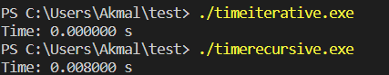
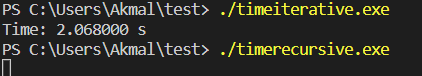
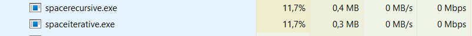

# Fibonacci Series
The Fibonacci numbers may be defined by the recurrence relation F0 = 0 , F1 = 1 , and Fn = F(n − 1) + F(n − 2) for n > 1. 

## Fibonacci Series using Iterative Method
The following is the code for Fibonacci Series using Iterative Method

```c
int iterative(int x){
    int f1 = 0;
    int f2 = 1;
    int output;
    if(x == 0){
        return f1;
    }else if(x == 1){
        return f2;
    }else{
        for(int i = 2; i <= x; i++){
            output = f1+f2;
            f1 = f2;
            f2 = output;
        }
        return output;
    }
}
```

## Fibonacci Series using Recursive Method
The following is the code for Fibonacci Series using Recursive Method

``` c
int recursive(int x){
    if(x == 0){
        return 0;
    } else if(x == 1){
        return 1;
    } else{
        return recursive(x-1)+recursive(x-2); 
    }
}
```

## Testing
In this section, I will show how to test out both of the approaches and its outputs.

### Run:
```
gcc -o teslib.o -c teslib/mylib.c
gcc -o test.exe test.c teslib.o
./test.exe
```

### Output:
```
The fibonacci number for 11 is 89
The fibonacci number for 11 is 89
The fibonacci number F(0) = 0 = 0
The fibonacci number F(1) = 1 = 1
The fibonacci number F(2) = 1 = 1
The fibonacci number F(3) = 2 = 2
The fibonacci number F(4) = 3 = 3
The fibonacci number F(5) = 5 = 5
The fibonacci number F(6) = 8 = 8
The fibonacci number F(7) = 13 = 13
The fibonacci number F(8) = 21 = 21
The fibonacci number F(9) = 34 = 34
The fibonacci number F(10) = 55 = 55
The fibonacci number F(11) = 89 = 89
```


## Benchmark
In this section, I will assess the performances of both iterative and recursive approaches through their time and space complexity.

### Time Complexity
- Run:
```
gcc -o timeiterative.exe timeiterative.c teslib.o
gcc -o timerecursive.exe timerecursive.c teslib.o
./timeiterative.exe
./timerecursive.exe
```

- Output:

(a small number will be too fast for my laptop to find the difference in the iterative method)

(a big number will be too slow for my laptop to find the difference in the recursive method)

As seen from the outputs, using the iterative approach is faster than the recursive approach.

### Space Complexity
I use 1000 as the input to test out the space complexity.
- Run:
```
gcc -o spacerecursive.exe spacerecursive.c teslib.o
gcc -o spaceiterative.exe spaceiterative.c teslib.o
./spaceiterative.exe
./spacerecursive.exe
```

- Output:


As seen from the outputs, the iterative approach takes up less space than the recursive approach.

## Conclusion
In conclusion, approaching the fibonacci series iteratively is more effective less time wasted and less space taken.